### ** The Simpsons: Performance and Popularity Indicators. **
####  By Angela Escobar

# Table of Contents
1. [Access to the Streamlit app](#access-to-the-streamlit-app)
2. [Project description and objective](#project-description-and-objective)
3. [Data preparation and processing](#data-preparation-and-processing)
4. [Analysis and development of the Streamlit app](#analysis-and-development-of-the-streamlit-app)
5. [Conclusions](#conclusions)
6. [Tech Stack](#tech-stack)

## Access to the streamlit app: 
You can access to the interactive dashboard at the following link: 

## Project description and objective

In this project, a database containing information about the television series The Simpsons was analyzed, with the aim of identifying relevant information about the factors that influenced the moments of highest and lowest popularity of the series, as well as its performance over the years.

The project aimed to answer the following specific questions:

How has the performance of the series been over time?
What were the moments of highest and lowest popularity of the series?
What factors influenced these situations?

## Data preparation and processing

In the preparation of this analysis project, the necessary metrics were determined to conduct the study. The database was located, downloaded, and subsequently securely and systematically organized on the computer. Additionally, se creo el repositorio para tener control de versiones disponible to ensure the security of the information.

For data processing, a thorough cleaning procedure was conducted, focusing on identifying erroneous or inaccurately entered data and removing any duplicated information. Additionally, outliers were identified and handled appropriately to ensure the integrity and accuracy of the dataset. Data normalization and transformation techniques were applied as needed to prepare the data for analysis. 

This is a list of the specific actions that were carried out. More detailed information can be found in the project code.

* Import datasets specifying separator
* Create new necessary dataframes
* Remove rows with missing values 
* Clean column names
* Remove empty spaces
* Create new necessary columns
* Review and correct the data type of each column (dates and numbers)
* Hide columns that would not be relevant for the analysis.
* Filter some columns to omit zero values
* Rename columns

## Analysis and development of the Streamlit app

An interactive dashboard was developed to facilitate the user's handling and understanding of the information. The user interface appeared as follows:

The specific aspects targeted for analysis were initially outlined, involving an intricate breakdown of the key focal areas slated for examination. The detailed execution of the analysis are further elaborated within the project's codebase. These are the results obtained after the process of analysis.

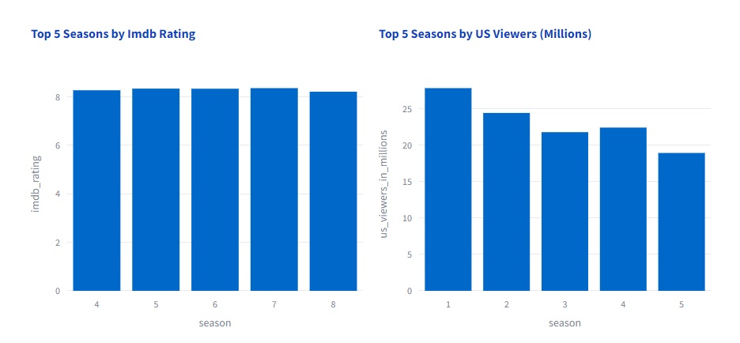
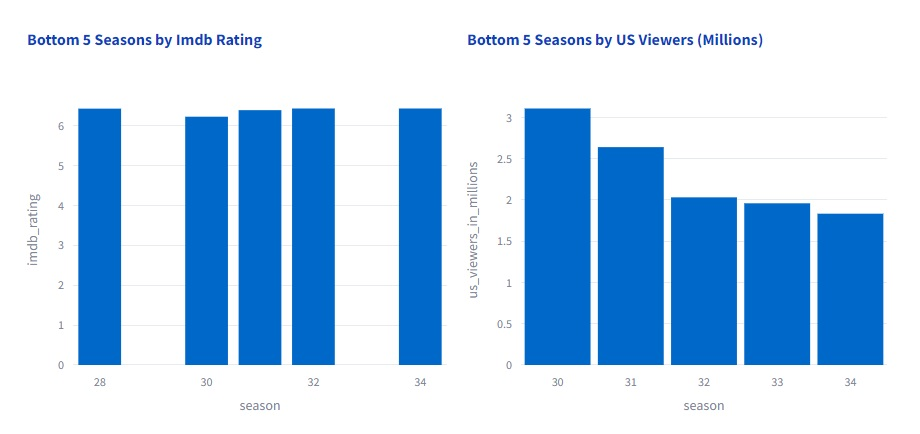
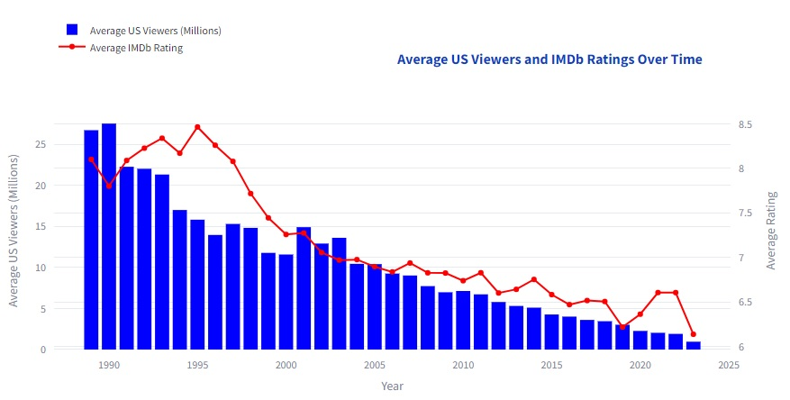
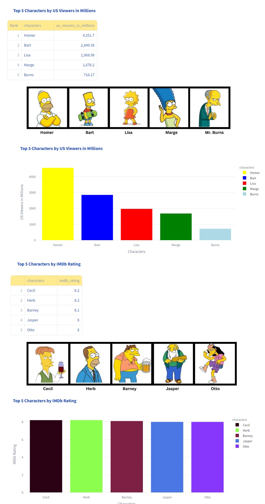
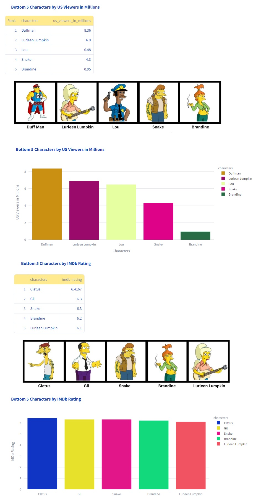
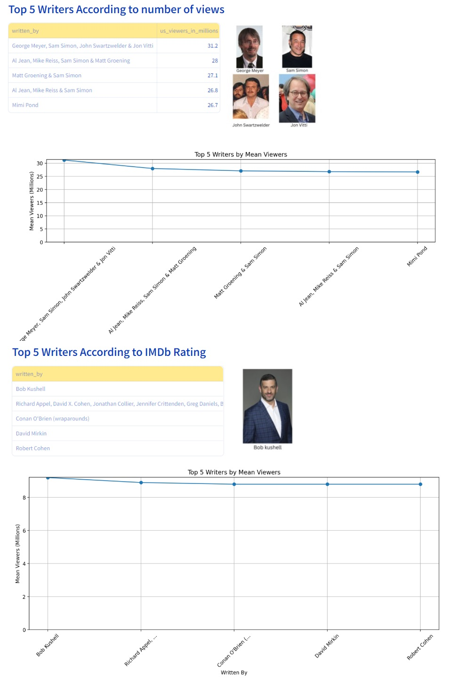
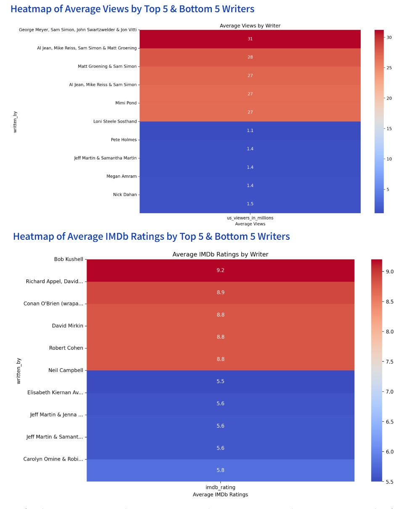
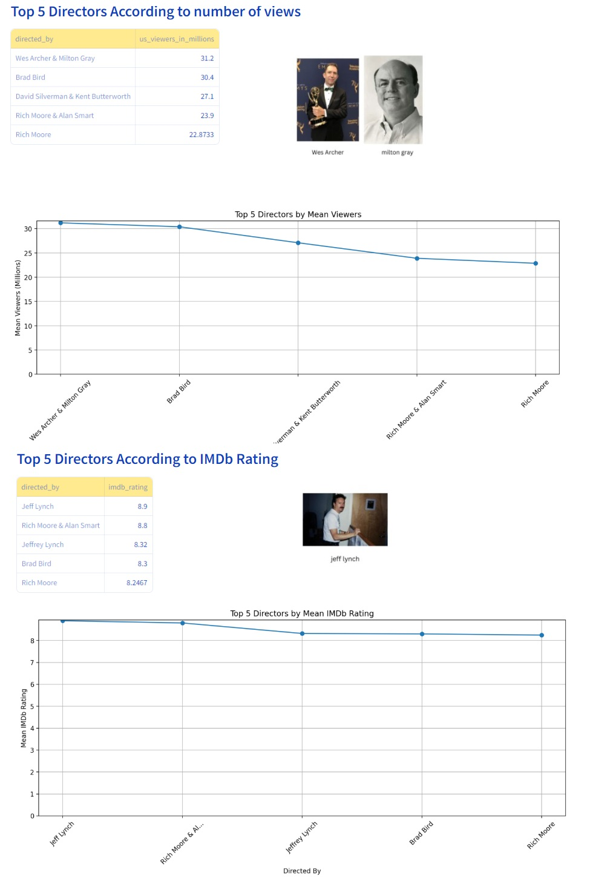
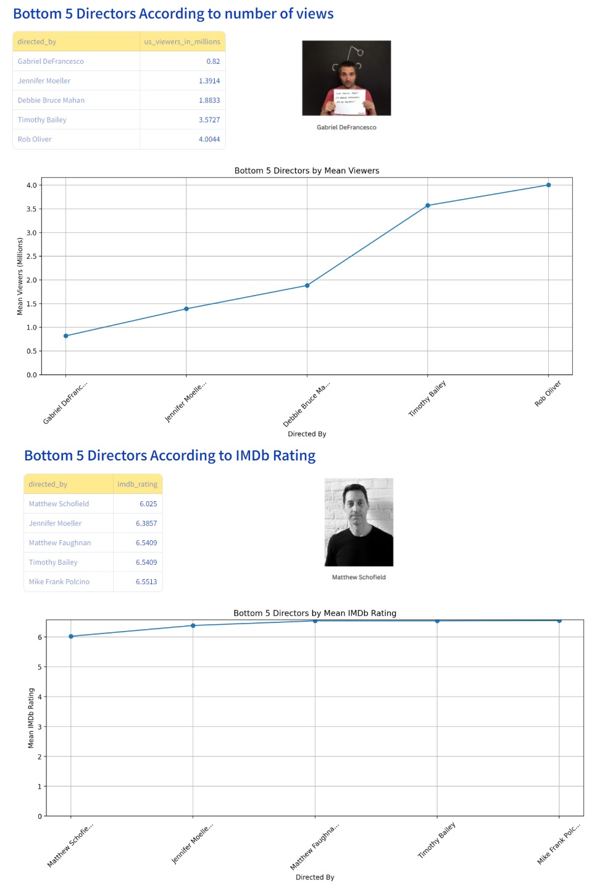
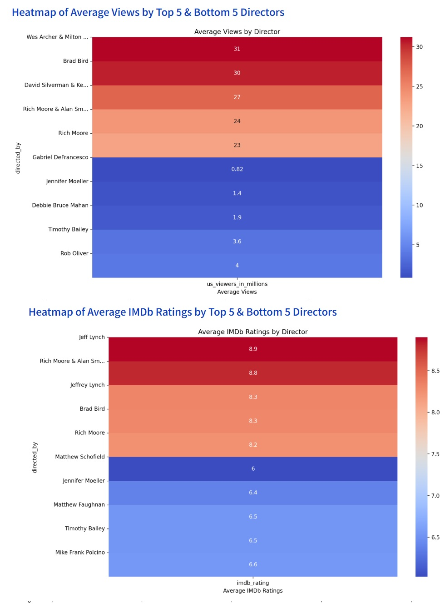
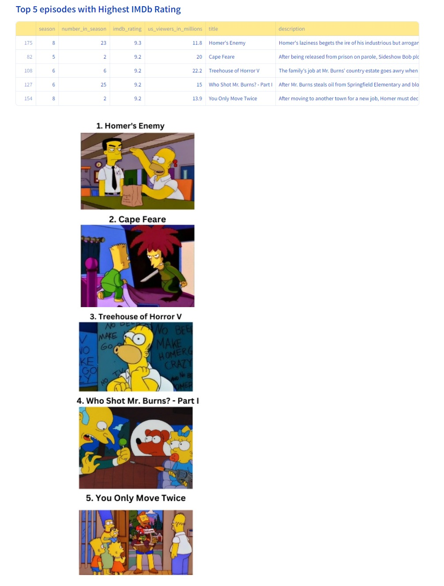
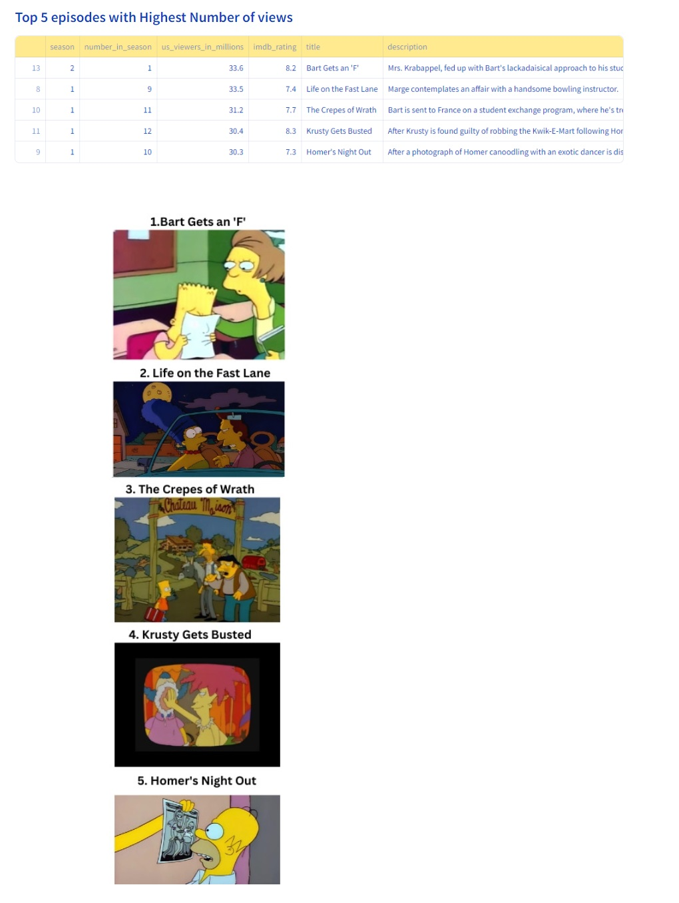
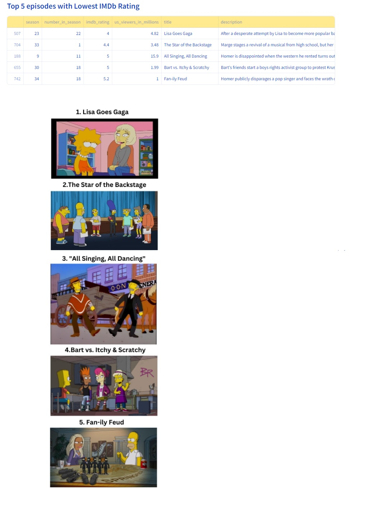
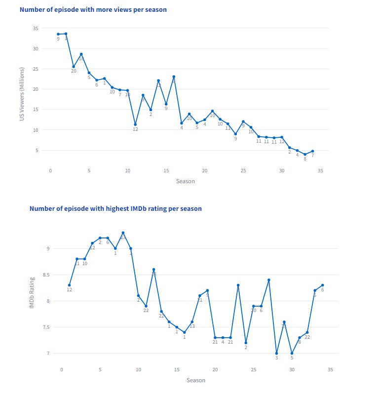
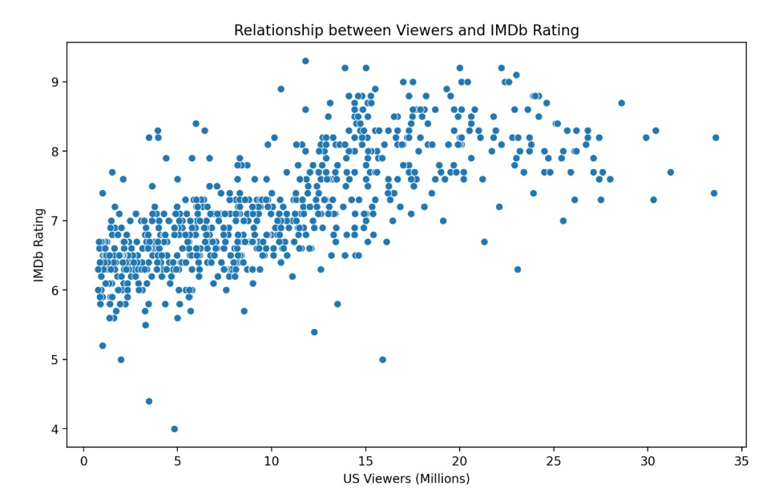
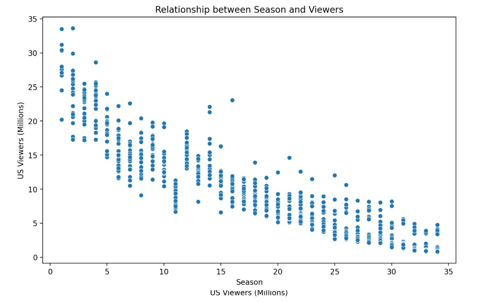
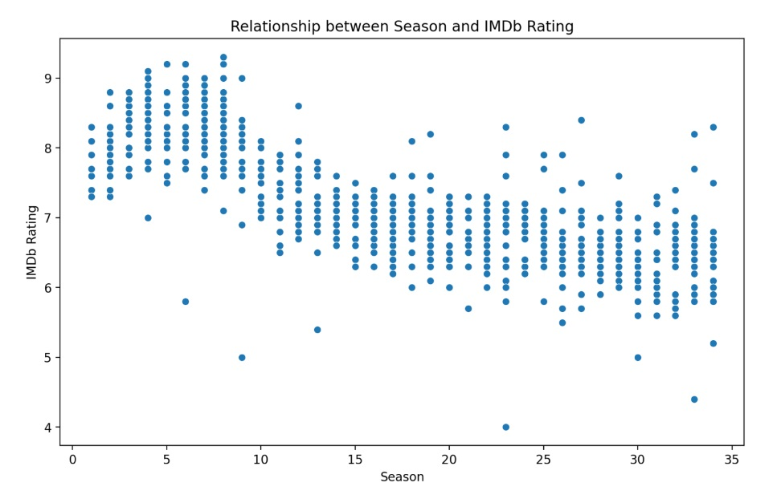

## Conclusions

* The audience and ratings have been on a downward trend over time. In the early 2000s, there was an increase in views and ratings, but it was not very significant, and since then, it has been declining. This could be due to the fact that the TV show offer has also increased significantly today compared to what it was in the 1990s.

* The characters that have accumulated the highest number of views are undoubtedly the protagonists (Homer, Marge, Bart, and Lisa); however, there are characters whose charisma has earned them the best ratings from viewers, such as Cecil, Herb, Barney, Jasper, and Otto.

* Characters towards whom viewers have not shown much approval include Duffman, Lurleen Lumpkin, Lou, Snake, Gil, Cletus, and Brandine.

* The writers with the highest number of views are also those who wrote for the early seasons, such as George Meyer, Sam Simon, John Swartzwelder, and Jon Vitti.

* Seasons 1 and 2 were the most viewed in the US, and the most popular according to the number of views based on this information. However, it is important to note that this database includes only US viewers, not those from the rest of the world.

* The seasons with the best results in the IMDb ranking were the middle seasons, seasons 4 to 8.

* In seasons 32 and 33, there was a slight increase in the ranking, indicating a slightly higher approval from viewers. However, it was not very significant compared to other seasons when the show was much more popular.

## Tech Stack

  Python

  Streamlit

  Visual Studio

_______________END OF CASE STUDY______________________
